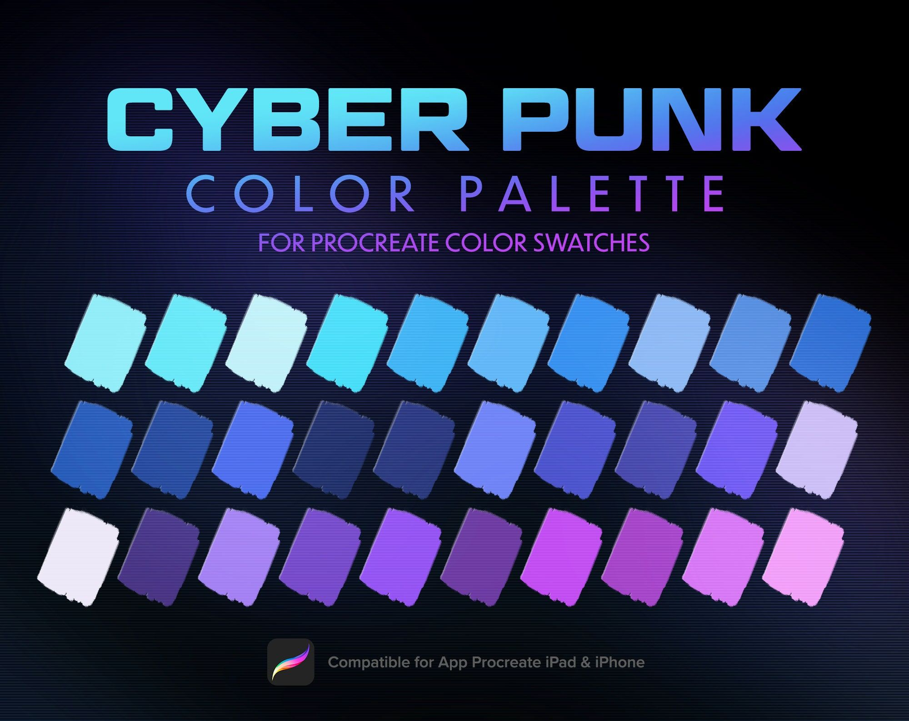
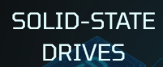
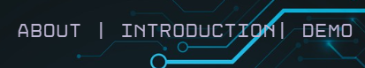
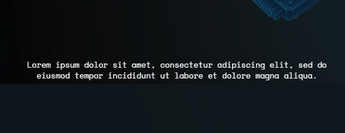
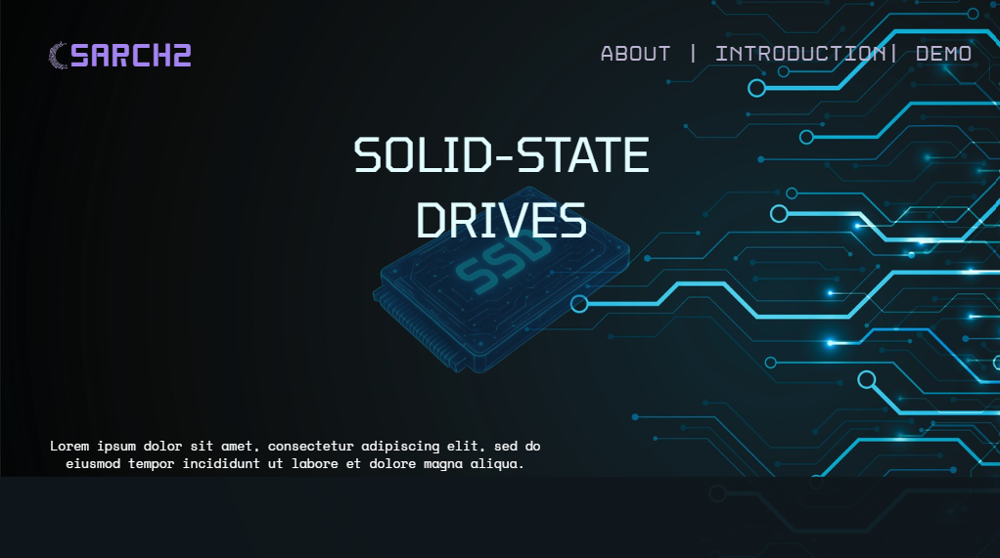

# Flash Memory: How SSDs Store Data

## GitHub Repository: https://github.com/pitowalosian/CSARCH2-ADEOS
## Deployed Website: https://pitowalosian.github.io/CSARCH2-ADEOS/

# Final Milestone Update

**Final Development Status:**

- We completed the full educational flow from the SSD architecture to the NAND Flash organization, memory celss, SLC/TLC, Wear Levelling, Garbage collection, the interactive demonstrations, summary, key takeaways, and the full reference list!
- We have added more animations to the page to make it feel less like a Powerpoint!
- Even if the mobile compatability has been removed from the rubric, we have polished the mobile view and responsiveness! It is now mobile friendly with tap interactions, accessible lables for mobile, and fixing animations from pc to mobile.
- We have renamed our group's entire file list so that it can be compatible with the MAIN virtual musuem! We have changed our .svg, .png, .jsx, .mdx, .astro, .css and added ADEOS_Group9_"Filename"! We have also meticulously renamed/prefixed the css selectors and classes to adeos-g9 as well!

**Group Technical Discussions:**
- This whole case project, we were discussing how to organize our exh`ibit using the files and repo given to us. So we agreed to have all png's, svg's in the assets folder, jsx and astro files in the components file for the interactive components and it should be different files for each section, MAKE SURE TO NOT TOUCH THE /LAYOUT FOLDER, make our own mdx for our page, and our own specific css for the page and specifics in the page!
- We also agreed to have separate or standalone elements uploaded in the assets folder for easier access and easier manipulation of those assets!
- For the ssd diagram interactable making, we had to add a cursor and a x,y coordinate to make the highlights more accurate. We agreed to make the text pressable and when it is pressed, it highlights the part it is pointing. It was kind of tricky to map the highlight to the part being pointed to, so we added the x,y mapping feature temporarily to make the mapping of the highlights much more precise!
- CSS selectors, filenames, components, and assets were given Group 9 prefixes so that we can avoid affecting the template homepage or conflicting with other exhibits when we are now merging with the main branch.
- Minor detail, we just used the network link to try test the mobile view.

**Group Creative Discussions:**
- The group brainstormed creative decisions for the final completion of the project. We reviewed and incorporated the professor’s comments and suggestions, ensuring our design adjustments aligned with them and also enhanced the user interface and user experience of our website.
- Additionally, we asked each other for constructive feedback on each other's parts, which includes animation designs, timing, flow, and layout of different sections. In this way, we were able to merge our ideas together to form common visual and functional aspects, which polished the final outcome of our work. 

**Group Realizations:**

**Group Challenges Encountered:**

**Declaration of AI Usage:**

- This project used AI assistance as a support and guiding tool. AI was used to suggest layout improvements, correct grammar mistakes, assist and explain feedback, dumb down terminologies and concepts, debug build and interaction issues, and assist with code optimization and code rating.
- The group remained responsible for the final content, design decisions, implementation, styling, testing, and documentation.

# Mid-Milestone Update

## Project Status 

**Completed tasks:**

- Researched about SSDs, NAND flash memory, and related concepts.
- Gathered and organized information about SSD architecture, NAND flash organization, memory cells, and the differences between Single-Level Cells (SLC) and Triple-Level Cells (TLC).
- Designed the interface following the proposed cyberpunk style.
- Developed a functional Astro website.
- Implemented the complete exhibit flow from the landing page through the NAND flash memory lessons.
- Implemented the interactive Write/Erase simulator with SLC/TLC switching and binary output.
- Implemented an interactable version of the NAND Cell Hierarchy section.

**Development insights** 

- The project introduced us to the Astro framework and React library, giving us a hands-on experience in interacting and working with them. With this, we obtained a better understanding on how real-world websites are built and structured. Additionally, we were able to develop a stronger grasp of our web development fundamentals due to the creation of interactive components. 
- Throughout the development process, we discovered that breaking the exhibit into multiple sections made the content easier to understand by presenting information in smaller, more manageable parts rather than overwhelming users all at once. We also found that interactive elements, such as the clickable NAND storage hierarchy and the Write/Erase simulator, were much more effective than static images in helping users visualize how NAND flash memory is organized and how it stores data.
- Extending the previous insight, when the group was designing the NAND Hierarchy section, we had a look and we just had to make it interactable as well. Since initially, it was supposed to be a stack of tiles and showing the hierarchy! We just had to do it to make it more engaging!
- Regarding the website template, everything just felt so seamless and smooth. It was so easy to implement and look at our changes. Very nice!
- During the development of the TLC and SLC demo it was decided that also adding the hex representation of the bitline's result would make the demo more entertaining.

**Challenges Encountered** 

- At first, the group was confused on what to do and where to start, but after looking at the guide and the example page of Linux, we were able to derive and take inspiration from it and started working.
- For the NAND Hierarchy, we had to remove most animations since it was laggy. So maybe, in the future, we will add more optimizations so that we can include animations without sacrificing performance so that the demos and interactable elements will look nicer and more engaging.
- The styling file was indirectly being used by the homepage, which we think is a problem since we are told not to modify some files, and we assume indirect changes count too. So to make it future-proof, we have painstakingly renamed styling and selector names so that they do not conflict with the homepage ones. Afterwards, we did a thorough manual search on which parts of the exhibit had been modified indirectly besides our page just to double check and to make sure it will not be in conflict when merging with the main exhibit repository.
- During the development of the TLC and SLC demonstrations, bugs and mistakes were made due to carelessness.

**Future Features:**

- Add clickable SATA and NVMe SSD visuals with highlighted NAND flash chips.
- Expand the Write/Erase simulator to support multiple memory cells.
- Include explanations of wear leveling and garbage collection.
- Improve mobile interactions and further polish the cyberpunk-inspired interface.
- Add animations to the interactable components.
- Completing the full original proposal of the group.

**Declaration of AI Usage:**

- This project used AI assistance as a support and guiding tool. AI was used to suggest layout improvements, correct grammar mistakes, dumb down terminologies and concepts, debug build and interaction issues, and assist with code optimization.
- The group remained responsible for the final content, design decisions, implementation, styling, testing, and documentation.

# CSARCH2 Virtual Exhibit Case Proposal

## Revision Highlights

This README contains the revised proposal for **Group 9: Adeos**. The revision addresses the proposal feedback to include more concept discussion in addition to the interactive element.

**Feedback addressed:**

> "Include also some concept discussion besides the interactive element."

**Changes made:**

- Added a **Concept Discussion** section explaining NAND flash organization and basic storage behavior.
- Clarified the use of **Single-Level Cells (SLC)** and **Triple-Level Cells (TLC)**.
- Corrected wording such as **SATA SSD**, **NAND**, **Single-Level Cell**, and **Triple-Level Cell**.
- Expanded and added more details to the style guide snapshot with colors, fonts, typography examples, diagram/icon style, and visual effects.
- Kept the exhibit interactive through clickable components, zoom-in transitions, SLC/TLC toggles, Write/Erase actions, and an output display.
- Added information tooltip when hovering above components of Nand flash cell and increased ammount of cells.

**Feedback attachment:** [Proposal feedback screenshot](docs/feedback/proposal-feedback.png)  
**Full original proposal:** [Initial proposal DOCX](docs/proposals/initial-proposal.docx)  
**Full Revised proposal:** [Revised proposal DOCX](docs/proposals/revised-proposal.docx)

---

## Group Information

**Group Title:** Adeos  
**Group Number:** 9  
**Course:** CSARCH2  
**Topic Theme:** Flash memory: How SSDs store data

## Group Members

- Abenojar, Fredrikzen
- Dollentas, Raine Anne
- Encisco, Gabriel Jeremy
- Obregon, Sian Ysabelle
- Singson, Keith Railey

---

## Topic Theme

This virtual exhibit explains how Solid-State Drives, or SSDs, store data using NAND flash memory. Instead of using spinning disks or moving parts, SSDs store information inside flash memory cells through electrical charge. The exhibit will focus on how a flash memory cell can represent binary data, how groups of cells form pages and blocks, and how this allows SSDs to store files electronically.

The main goal of the exhibit is to help visitors understand that digital data is stored as 0s and 1s, and that SSDs preserve those values using flash memory cells. Through a simplified interactive NAND flash simulator, visitors will be able to write binary data into memory cells and see how charged and uncharged states can represent stored information.

---

## Tech Stack Plan

### Exhibit Overview

Our exhibit will focus primarily on how SSDs store data through NAND flash memory, showcasing the tiny scale and sheer number of components that make up SSDs.

There will be three parts to the exhibit. The first part will show SATA and NVMe SSDs with their NAND flash chips highlighted. Clicking a NAND flash chip will bring the visitor to the second part of the exhibit, which will show a simplified version of the chip's internal components: a die with planes, blocks, and pages.

The main part of the exhibit will cover the individual components that store data: **Single-Level Cells (SLC)** and **Triple-Level Cells (TLC)**, which store 1 bit and 3 bits per cell respectively. Both will be shown because Single-Level Cells are easier to understand, while Triple-Level Cells are commonly used in modern NAND flash memory. The exhibit will showcase simplified interactive versions of both SLC and TLC, along with an output screen that users can experiment with.

---

## Proposed Interactive Element

The exhibit will begin by showing viewers a **SATA SSD** and an **NVMe SSD**, both with visible NAND flash memory chips highlighted to emphasize interactivity. Users will be able to click on any of the NAND flash memory chips. Regardless of which chip the user clicks, the user will be brought to a simplified zoomed-in scene of a die with planes, blocks, and pages.

Each component of the NAND flash chip will be interactive. Hovering over a component will show information about it in a tab next to the scene. Clicking on a page will play a zoom-in transition showing that each page is made of thousands of cells. After the transition, the viewer enters another scene showing three cells in series, including parts of each individual cell such as the control gate, source and drain, oxide layer, and TLC or SLC storage behavior.

Each component in the cell scene will also display information when hovered over. On the top-left of this scene, there will be a toggle that allows users to switch between TLC and SLC views.

The viewer will act as the SSD's controller. The control gates of each cell will have two clickable instructions: **Write** and **Erase**. The **Write** instruction will increase the charge by adding electrons to the gate, while **Erase** will return the gate to a zero state. The part of the gate where electrons transfer will increase in brightness whenever an instruction is pressed. Depending on the charge state of the cells, an output screen next to the scene will display the value stored in the cells. The current charge state of the cell being hovered over or selected will also be displayed.

---

## Concept Discussion

SSDs store their data in NAND flash memory chips, which are made of multiple stacked grids of individual NAND memory cells. NAND flash memory cells are arranged in a hierarchy that includes strings, word lines, pages, blocks, planes, dies, and chips. In a simplified view, pages are the smallest addressable units for read and write operations, while blocks are larger groups of pages and are the smallest units that can be erased at once.

NAND flash cells usually store 1 to 3 bits of information, although some versions can store more. Each NAND flash cell stores information by holding electrons in a floating gate. The amount of charge stored in the cell affects how the SSD interprets the value of that cell. A reference voltage can be used to help determine the stored value during a read operation.

A NAND flash cell can also write and erase data. Write and erase instructions are sent through the control gate using certain voltages. A write operation adds electrons to the floating gate, while an erase operation removes electrons and resets the cell. This concept discussion prepares visitors for the interactive part of the exhibit, where they can explore how charge states represent stored data in simplified SLC and TLC cells.

---

## Mobile-Responsive Layout

The exhibit will be designed to work on desktop, tablet, and mobile screens. On desktop, the interactive scene and information panel will be displayed side by side. This allows users to explore SSD components while reading short explanations at the same time.

On smaller screens, the layout will shift into a vertical format. The interactive scene will appear first, followed by the controls, output screen, and explanation panel. Since mobile devices do not use hover, hover interactions will be replaced with tap-based selection. When users tap an SSD part, NAND chip, page, block, or memory cell, the selected component will stay highlighted and its information will remain visible even after the user lifts their finger. When the user taps another component, the information panel will update to show the newly selected part. If the user taps outside the interactive area or selects a close button, the information panel may disappear or reset.

The exhibit will not rely on long-press interactions because they may be less intuitive for visitors. Simple taps will be used for selecting components, switching between SLC and TLC views, and interacting with the memory cells. When users play with the cells, the output screen and information panel will show the current cell state, instruction, and stored value.

The mobile layout will use larger buttons, responsive diagrams, simplified labels, and stacked information cards. The SLC/TLC toggle, Write and Erase buttons, and output screen will also resize for easier touch interaction.

---

## Tentative Style Guide Snapshot

### Theme

**Minimalist Cyberpunk**

The exhibit will use a clean futuristic interface with dark backgrounds, glowing highlights, and circuit-inspired visual elements. The style is intended to match the SSD and NAND flash memory topic while keeping the exhibit readable and beginner-friendly.

### Color Palette



The exhibit will use a dark color scheme consisting of black, dark blue, and gray backgrounds accented with neon cyan, blue, and purple highlights. These accent colors will emphasize interactive components such as SSD parts, NAND flash chips, memory cells, control buttons, and output displays.

**Example usage:**

| UI Element | Color Direction |
| --- | --- |
| Background | Near black / dark navy |
| Main text | White or light gray |
| Primary accent | Cyan / electric blue |
| Secondary accent | Purple |
| Active cell highlight | Neon green or cyan glow |
| Inactive cell | Dark gray or muted blue |
| Warning or note | Amber |

### Font

| Element | Font |
| --- | --- |
| Heading | Tomorrow |
| Links | Disket Mono |
| Body | Space Mono |

### Typography

| Element | Style Rule | Example |
| --- | --- | --- |
| Heading (`h1`) | `font-family: "Tomorrow"; font-size: 200%; text-align: center;` |  |
| Link (`a`) | `font-family: "Disket Mono"; font-size: 150%; text-align: center;` |  |
| Body text (`p`, `span`) | `font-family: "Space Mono"; font-size: 80%; text-align: center;` |  |

### Visual Sample of Home Page



### Layout Style

The exhibit will use a card-based layout with clear sections. Each major part of the exhibit will be placed inside a visually distinct section or panel.

- Rounded information cards
- Interactive diagram panels
- Component explanation boxes
- Toggle controls
- Output screen panel
- Step-by-step navigation buttons
- Short callout boxes for important concepts

The layout will avoid long walls of text. Instead, explanations will be broken into short, focused sections that appear when the user interacts with components.

### Diagram and Icon Style

Adeos' exhibit will mainly use geometric shapes for dies, planes, blocks, and pages instead of realistic illustrations. SSDs, NAND chips, and cells will be represented using clean outlines, grid highlights, and labeled sections. Icons and labels will remain visually minimal so the exhibit does not overwhelm users while still maintaining the cyberpunk theme.

### Visual Effects

Selected, active, and clickable components will mainly use glow effects. Hover states and tap states may use neon outlines, brightness changes, or shadows to show interactivity. Simple zoom transitions, highlighting effects, and brightness-change animations will be subtle to avoid excessive movement that could distract from the learning experience.

### Proposed Exhibit Layout

This layout moves from larger SSD components to smaller internal structures:

```text
Hero Section (Landing Page; Shows the SSD)
->
Introduction: What Is an SSD?
->
Interactive Scene 1: Click a NAND Flash Chip
->
Interactive Scene 2: Explore Die, Planes, Blocks, and Pages
->
Transition: Zoom Into a Page Containing Cells
->
Interactive Scene 3: Explore Single-Level and Triple-Level Cells
```

---

## References

ATP Electronics. (2025, May 5). NAND die stacking explained. https://www.atpinc.com/blog/what-is-nand-die-stacking
Bigelow, S. J., & Jones, M. (2023, May 12). What is NAND flash memory? TechTarget. https://www.techtarget.com/searchstorage/definition/NAND-flash-memory
Kingston Technology. (2026, April 16). 2D vs. 3D NAND: Differences between SLC, MLC, TLC, and QLC flash storage. https://www.kingston.com/en/blog/pc-performance/difference-between-slc-mlc-tlc-3d-nand
KIOXIA Corporation. (n.d). What is multi-level cell technology realizing larger capacity flash memory? https://www.kioxia.com/en-jp/rd/technology/multi-level-cell.html
KIOXIA Corporation. (n.d). What is NAND flash memory? https://www.kioxia.com/en-jp/rd/technology/nand-flash.html
Prasad, A. (2026, February 7). Flash memory explained: NAND vs. NOR, architecture, and memory organization. DEV Community. https://dev.to/amanprasad/flash-memory-explained-nand-vs-nor-architecture-and-memory-organization-3abf
Samsung Semiconductor. (2026, July 3). A brief history of data placement technologies. https://semiconductor.samsung.com/news-events/tech-blog/a-brief-history-of-data-placement-technologies/